# OmniGem Gallery — Core Domain Class Diagram (P2 Design)

Status: DRAFT for Gate G1. Author: solution-architect. Approvers: Architect + Security.
Companion: `hld-lld.md` (Part B), `erd.md`, `api-spec.yaml`.

## 1. Class diagram — domain services

```mermaid
classDiagram
    class LeadService {
        +create(tx, input: LeadInput, source: LeadSource, consentId) Lead
        +findForContact(ref) Lead
        +anonymize(leadId) void
    }
    class ConsentService {
        +record(tx, input: ConsentInput) ConsentRecord
        +withdraw(leadId, policyVersion) ConsentRecord
        +getByLead(leadId) ConsentRecord[]
    }
    class ChatbotService {
        -maxIterations: int
        +turn(req: ChatTurnRequest) ChatReply
        -ensureSessionConsent(sessionId, consent) ConsentRecord
        -loadServerState(sessionId) Message[]
        -runToolLoop(serverMessages) ClaudeResult
        -persistTranscript(sessionId, scrubbed) void
    }
    class SensitiveInputScrubber {
        +scrub(text) ScrubResult
        -stripLuhnCardNumbers(text) text
        -redactSensitiveCategories(text) text
    }
    class SessionAuthority {
        +issueSigned(challengeResult) sessionToken
        +verifySigned(sessionToken) sessionId
    }
    class SpendCircuitBreaker {
        +ok() bool
        -monthlyCapVnd: number
    }
    class ProductQueryService {
        +search(menh, loai, giaMax) Product[]
        +getByCode(code) Product
        +getFaqContext(query) FaqChunk[]
    }
    class DsrService {
        +intake(input: DsrInput) DSRRequest
        +assignOwner(dsrId, owner) void
        +verifyIdentifier(dsrId) Verified
        +fulfil(dsrId, action, approverId) void
    }

    class SearchProductsTool {
        +name: "search_products"
        +inputSchema: JSONSchema
        +invoke(args) ToolResult
    }
    class HandoffToZaloTool {
        +name: "handoff_to_zalo"
        +inputSchema: JSONSchema
        +invoke(args) ToolResult
    }

    class ClaudeApiAdapter {
        +createMessage(system, messages, tools) ClaudeResult
        -promptCache: enabled
    }
    class CmsAdapter {
        +fetchProducts(filter) Product[]
        +fetchFaq() FaqChunk[]
    }
    class ZaloLinkBuilder {
        +build(productCode?) string
    }
    class LeadRepository {
        <<interface>>
        +save(Lead) Lead
        +save(ConsentRecord) ConsentRecord
        +save(ChatTranscript) ChatTranscript
        +save(DSRRequest) DSRRequest
    }

    class Lead {
        +id
        +name  PII
        +phone  PII
        +zaloId  PII
        +dob  PII
        +productInterest  PII
        +source
        +status
    }
    class ConsentRecord {
        +id
        +policyVersion
        +purpose
        +method
        +capturedAt
        +eventType
    }
    class ChatTranscript {
        +id
        +sessionId
        +messages  PII
        +sensitiveFlagged
    }
    class DSRRequest {
        +id
        +requestType
        +status
        +owner
        +ackBy
    }

    ChatbotService --> SensitiveInputScrubber : scrub BEFORE Claude call (C-1)
    ChatbotService --> SessionAuthority : verify signed sessionId (H-1)
    ChatbotService --> SpendCircuitBreaker : denial-of-wallet guard (H-1)
    ChatbotService --> ClaudeApiAdapter
    ChatbotService --> SearchProductsTool
    ChatbotService --> HandoffToZaloTool
    ChatbotService --> LeadService : handoff creates lead
    ChatbotService --> ConsentService
    SearchProductsTool --> ProductQueryService
    HandoffToZaloTool --> ZaloLinkBuilder
    HandoffToZaloTool --> LeadService
    ProductQueryService --> CmsAdapter
    LeadService --> LeadRepository
    ConsentService --> LeadRepository
    DsrService --> LeadRepository
    LeadService --> Lead
    ConsentService --> ConsentRecord
    ChatbotService --> ChatTranscript
    DsrService --> DSRRequest
    Lead --> ConsentRecord : evidencedBy
```

## 2. Responsibilities & invariants

| Service | Responsibility | Key invariant (reviewer focus) |
|---|---|---|
| **LeadService** | Create/anonymize leads; single source of truth for both form + chatbot leads (US-C1, US-D3 AC2) | Every lead references a ConsentRecord; writes go through the repository, never raw SQL from route handlers |
| **ConsentService** | Art. 11 reproducible consent (US-H2) | Records are append-only; `policyVersion` non-null; written in the **same transaction** as the lead |
| **ChatbotService** | Claude tool-calling loop, guardrails, transcript persistence | **Consent-first (H-3):** session ConsentRecord written before any PII processing/persistence. **Server-authoritative state (H-2):** never trusts client assistant turns; re-injects guardrail prompt every turn; validates tool outputs; per-session handoff-lead rate-limit. Bounded `maxIterations`; graceful Zalo fallback (R-06/R-09) |
| **SensitiveInputScrubber** | Input-side redaction **before** the cross-border call (C-1, M-7) | Strips Luhn-valid card-number strings (preserves no-card-data invariant) + redacts Art. 2(4) sensitive categories; runs before `ClaudeApiAdapter.createMessage`, not at storage time |
| **SessionAuthority** | Issue/verify HMAC-signed session tokens (H-1) | sessionId is server-issued and signature-verified; client-supplied values are never trusted; signing key in secret store |
| **SpendCircuitBreaker** | Hard global Claude spend cap (H-1) | On trip, chatbot fails over to Zalo-only; enforced, not merely alerted (NFR-6 FIRM) |
| **ProductQueryService** | Live catalog/FAQ retrieval for RAG | Returns **only** CMS-sourced data (no hallucinated inventory — US-D1 AC2) |
| **DsrService** | Art. 9/10 intake, ownership, SLA, **identifier verification** (US-H3, H-4) | Every request logged + owner + `ackBy` on intake; **no disclosive/mutating fulfilment until `verifyIdentifier` (OTP to on-record channel) succeeds**; `fulfil` requires a distinct `approverId` (P5 maker-checker) |
| **ClaudeApiAdapter** | Encapsulates the ⚠️ cross-border Claude call (Art. 25) | Sends only scrubbed minimal context; **no-training/zero-retention DPA is a blocking prerequisite (C-1, ADR-0003)**; API key from secret store only; prompt caching for cost |
| **LeadRepository** | Abstracts the concrete store (ADR-0002) | Interface stable whether store is Postgres/CRM; enforces encryption-at-rest boundary |

## 3. Tool-calling contract (Anthropic Messages API)

Both tools expose `{name, description, input_schema}` to the Claude API (see `api-spec.yaml` and `hld-lld.md` B.2). `search_products` is read-only over Public CMS data; `handoff_to_zalo` has the side effect of creating a chatbot-sourced Lead + Zalo deep-link. The orchestration loop dispatches `tool_use` blocks and returns `tool_result` blocks until `end_turn`.
