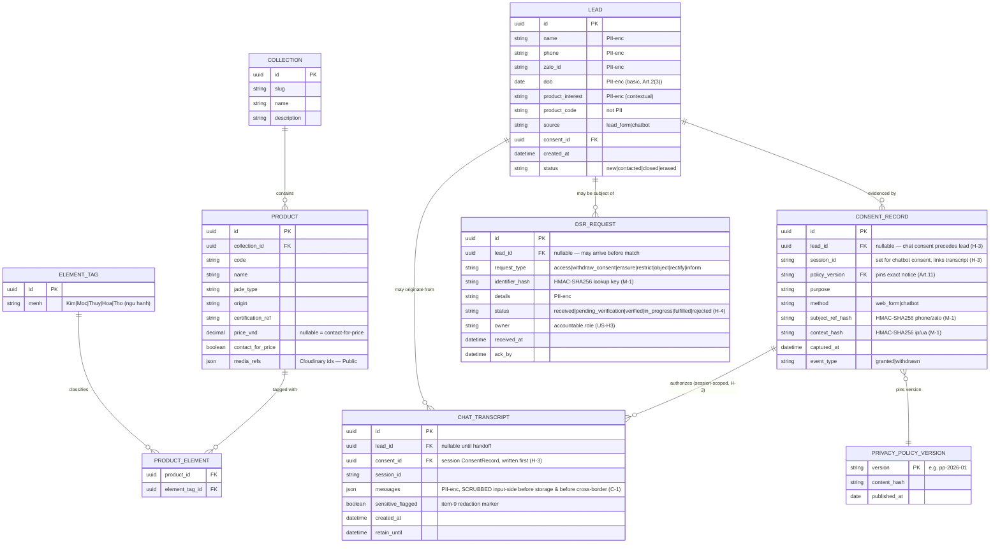

# OmniGem Gallery — Entity Relationship Diagram (P2 Design)

Status: DRAFT for Gate G1. Author: solution-architect. Approvers: Architect + Security.
Maps to `hld-lld.md` (domain services), `class-diagram.md`, `data-classification.md`.

G1 criterion: "ERD complete, PII/card-data fields flagged." **No card data exists in this domain** (no PCI scope). PII fields are flagged in the diagram (`PII` / `PII-enc`) and enumerated in §2.

## 1. ERD

## 2. PII / personal-data field register (Decree 13/2023)

Legend: **Public** = no personal data · **PII** = personal data · **PII-enc** = personal data, application-layer encrypted at rest (in addition to storage encryption) · **Card data** = none.

| Entity | Field | Classification | Encryption at rest | Notes |
|---|---|---|---|---|
| COLLECTION | all | Public | storage-level | Catalog content |
| PRODUCT | all (incl. price, media_refs) | Public | storage-level | No customer data |
| ELEMENT_TAG / PRODUCT_ELEMENT | all | Public | storage-level | Ngũ hành tags |
| PRIVACY_POLICY_VERSION | all | Public | storage-level | Notice text/hash for Art. 11 pinning |
| LEAD | name | **PII-enc** | AES-256 + column/app-layer | Directly identifying |
| LEAD | phone / zalo_id | **PII-enc** | AES-256 + column/app-layer | Identifying + contact channel |
| LEAD | dob | **PII-enc** | AES-256 + column/app-layer | Basic personal data Art. 2(3); consent still required |
| LEAD | product_interest | **PII-enc** | AES-256 | Contextual PII |
| LEAD | product_code / source / status | Internal (not PII) | storage-level | — |
| CONSENT_RECORD | policy_version / purpose / method / session_id / captured_at / event_type | Internal (evidence) | storage-level | Art. 11 reproducible record; **DB-enforced append-only (M-6)**; `session_id` links chatbot consent (H-3) |
| CONSENT_RECORD | subject_ref_hash / context_hash | Pseudonymized PII | **HMAC-SHA256, keyed (M-1)** | Keyed hash resists brute-force of low-entropy phone/email from a store leak |
| CHAT_TRANSCRIPT | messages | **PII-enc** | AES-256 | **Scrubbed input-side (C-1): Art. 2(4) sensitive + Luhn card strings removed BEFORE the cross-border call and before storage** (item 9) → `sensitive_flagged` |
| CHAT_TRANSCRIPT | session_id / retain_until | Internal | storage-level | Retention control |
| DSR_REQUEST | identifier_hash / details | **PII-enc** | AES-256 / hashed lookup | Rights request payload |
| DSR_REQUEST | request_type / status / owner / ack_by | Internal | storage-level | Workflow metadata |

**Card data:** none — confirmed out of scope (data-classification item 15). No PAN/CVV/expiry entity exists by design.

## 3. Design notes for compliance / reviewers

- **Art. 11 reproducibility:** `CONSENT_RECORD` is append-only; a withdrawal is a new row (`event_type=withdrawn`), never an update — so any past consent state is reconstructable (US-H2 AC2).
- **Erasure (US-H3 AC3):** `LEAD.status=erased` + null/crypto-shred PII-enc columns; `CHAT_TRANSCRIPT` flagged for removal — subject to legal-retention override (e.g., active DPIA/audit).
- **Retention:** `retain_until` on transcripts and proposed 24-month lead retention (data-classification #5) drive a scheduled purge job.
- **Cross-border (Art. 25) + C-1 fix:** `CHAT_TRANSCRIPT.messages` is what transits to Anthropic — the `SensitiveInputScrubber` runs **input-side, before the Claude call** (not just before storage), so sensitive/card-shaped content never leaves Vietnam. A no-training/zero-retention Anthropic DPA is a blocking prerequisite (ADR-0003).
- **Chatbot consent atomicity (H-3):** a `CONSENT_RECORD` (method=chatbot, `session_id` set, `lead_id` null) is written on the first PII-bearing turn **before** any `CHAT_TRANSCRIPT` row exists; `CHAT_TRANSCRIPT.consent_id` FK enforces the link.
- **DSR identity (H-4):** disclosive/mutating requests move `received → pending_verification → verified` (OTP to on-record channel) before `fulfil`, which additionally requires a distinct human approver (P5 maker-checker).
