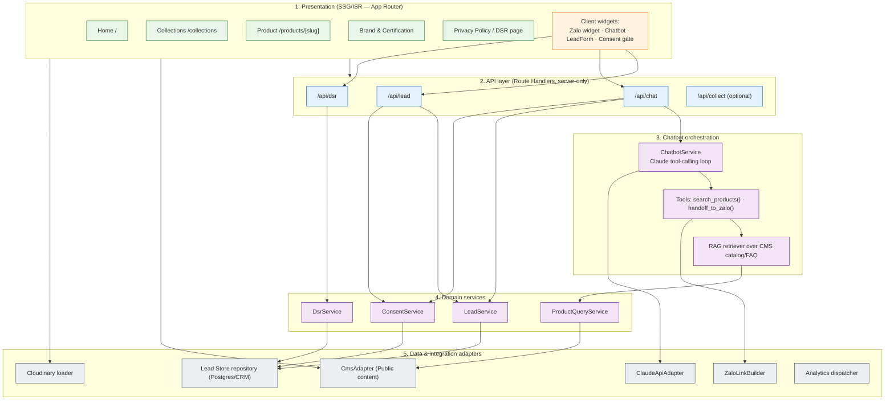

# OmniGem Gallery — HLD / LLD (P2 Design)

Status: DRAFT for Gate G1. Author: solution-architect. Approvers: Architect + Security.
Companion files: `system-context.md`, `nfr-targets.md`, `api-spec.yaml`, `erd.md`, `class-diagram.md`, `adr/`.

---

## PART A — HIGH-LEVEL DESIGN (HLD)

### A.1 Layered component breakdown



### A.2 Rendering strategy per page type (NFR-3; detailed rationale in ADR-0004)

| Page type | Strategy | Revalidate | Why |
|---|---|---|---|
| Home `/` | SSG + ISR | 60 min (+ on-publish webhook) | Curated, changes rarely; needs top CWV |
| Collections `/collections` | SSG + ISR, **client-side filtering** of the prefetched set | 30 min | Filter (mệnh/category) is instant client interaction; crawlable base HTML |
| Product Detail `/products/[slug]` | SSG + ISR, `generateStaticParams` | 30 min (+ webhook) | Core SEO surface (US-E1 Product JSON-LD); catalog editable via CMS (US-F1) |
| Brand / Certification / Blog | SSG + ISR | 60 min | Content pages |
| Privacy Policy | SSG (versioned) | on publish | **Consent record references its version** (US-H2) |
| DSR intake page | SSG shell + client form → `/api/dsr` | — | Static shell, dynamic submit |
| API routes | Dynamic (server, `runtime=nodejs`) | never cached | Handle PII; must not be statically cached |

**Rule (FIRM):** No response that contains PII is ever cached at the edge/CDN. API routes set `Cache-Control: no-store`.

### A.3 Data flows — the 3 sensitive flows (threat-modeler will build STRIDE sequence diagrams for these)

**Flow 1 — Lead-form submission (US-C1, US-H2; R-01, R-03)**
1. Visitor loads Contact page (SSG). Consent gate renders the **current Privacy Policy version** + explicit consent checkbox (unticked by default).
2. Client validates, POSTs `{name, phone/zalo, dob, productInterest, consent:{version, granted:true}}` to `/api/lead` over TLS.
3. Route handler: origin/CSRF check → rate-limit → **Zod schema validation** → reject if `consent.granted !== true`.
4. `ConsentService.record()` writes a **ConsentRecord** (policy version, purpose, timestamp, method, hashed request context) — Art. 11 reproducible record, written **in the same DB transaction** as the Lead.
5. `LeadService.create()` writes **Lead** (PII, encrypted at rest) with `source="lead_form"`.
6. Return 201 + confirmation; fire `submit_lead_form` analytics event (no PII in event).
7. On DB failure: 503 retriable + surface Zalo fallback CTA (NFR-4). Never partial-commit (consent without lead or vice-versa).

**Flow 2 — Chatbot conversation + handoff (US-D1/D2/D3; R-04, R-09). Revised for review findings C-1, H-1, H-2, H-3.**
1. Visitor opens chatbot. A **bot challenge** (Cloudflare Turnstile / Vercel bot protection) must pass before the session starts (**H-1** denial-of-wallet). The server issues an **HMAC-signed `sessionId`** bound to the challenge result; the client cannot forge or rotate it (**H-1**). A consent micro-notice is shown **before any PII-bearing turn**.
2. Each turn the client POSTs **only the new user message + the signed `sessionId` + a `consent` assertion** to `/api/chat` — **never prior assistant turns** (**H-2** forged-history bypass). Handler verifies the challenge/signature, enforces **server-side** per-session message/token caps, and loads **server-authoritative conversation state** from its own store (client history is not trusted).
3. **Consent is atomic (H-3):** on the **first PII-bearing turn** the server writes a **session-scoped `ConsentRecord`** (method=`chatbot`, policy version pinned) **before** any transcript persistence or DOB use — mirroring the lead-form path (ADR-0005). `consent.granted !== true` ⇒ the turn is rejected and no PII is processed or stored.
4. **Input scrubber runs BEFORE the cross-border call (C-1, folds in M-7):** `SensitiveInputScrubber.scrub(userMessage)` classifies/redacts incidental Art. 2(4) sensitive content (health/belief/financial) **and** strips any **Luhn-valid card-number-shaped string** so it never leaves Vietnam and the no-card-data invariant is preserved. Only the scrubbed text is passed to `ClaudeApiAdapter`.
5. Server re-injects the **guardrail system prompt every turn** (never solicit sensitive data; data-minimization; mandatory handoff on purchase intent; RAG-only grounding) — client cannot suppress it (**H-2**; data-classification item 9; R-09).
6. `search_products(menh, loai, gia)` → `ProductQueryService` → `CmsAdapter` (live catalog, **no hallucinated inventory** — US-D1 AC2). RAG grounds FAQ answers in CMS FAQ content (US-D2, R-10). Tool-call **outputs are validated** before being returned to the model (**H-2**).
7. `handoff_to_zalo()` → builds a Zalo deep-link AND calls `LeadService.create(source="chatbot")` **linked to the already-written session ConsentRecord**. Handoff-driven lead creation is **rate-limited/deduped per session** to prevent injection-forced lead spam (**H-2**).
8. **⚠️ CROSS-BORDER (C-1, Art. 25):** only the **scrubbed** minimal turn context is sent to Anthropic. A signed **Anthropic DPA with no-training / zero-retention is a BLOCKING go-live prerequisite** (see ADR-0003) and is referenced by the Art. 24 DPIA + Art. 25 dossiers. Scrubbed transcript persisted as `ChatTranscript` with `sensitive_flagged`.
9. **Global spend circuit-breaker (H-1):** a hard monthly Claude API spend cap (FIRM, `nfr-targets.md §6`) trips the chatbot into Zalo-handoff-only fallback. If Claude API errors/times out ⇒ graceful message + Zalo CTA (never a hard failure; NFR-4, R-06).

**Flow 3 — Analytics event capture (US-G1; data-classification 11/12)**
1. On instrumented interactions (`view_product`, `click_zalo`, `submit_lead_form`, `chatbot_handoff`) the client dispatches events to GA4 + Meta Pixel.
2. Tags load **only after analytics consent** (consent gate). Events carry **no direct PII** (no name/phone/DOB) — product IDs and event names only.
3. Optional hardening (`/api/collect` proxy): first-party server relay to reduce client-side identifier leakage and enable consent-mode enforcement server-side.

---

## PART B — LOW-LEVEL DESIGN (LLD)

> TypeScript signatures (Next.js App Router, `runtime = "nodejs"`). Validation via Zod. Persistence via a repository interface (ADR-0002 picks the concrete store; interface is stable either way). Full request/response schemas live in `api-spec.yaml`; domain classes in `class-diagram.md`.

### B.1 `POST /api/lead` — lead intake

```ts
// app/api/lead/route.ts   — export const runtime = "nodejs"; dynamic, no-store
const LeadInput = z.object({
  name: z.string().min(1).max(120),
  contact: z.object({ phone: z.string().regex(VN_PHONE).optional(),
                      zaloId: z.string().max(120).optional() })
             .refine(c => c.phone || c.zaloId, "phone or zaloId required"),
  dob: z.string().date().optional(),                 // basic personal data (Art. 2(3))
  productInterest: z.string().max(500).optional(),
  productCode: z.string().max(40).optional(),
  consent: z.object({ policyVersion: z.string(), granted: z.literal(true) }),
});

export async function POST(req: Request) {
  assertSameOrigin(req);                              // TB-1 CSRF/origin
  await rateLimit(req, "lead");                       // NFR-4 abuse control
  const input = LeadInput.parse(await req.json());    // fail-fast validation
  const ctx = requestContext(req);                    // ip-hash, ua-hash (no raw PII in logs)
  const { leadId } = await db.tx(async t => {         // atomic: consent + lead together
    const consent = await consentService.record(t, {
      policyVersion: input.consent.policyVersion, purpose: "lead_followup+fengshui",
      method: "web_form", subjectRef: input.contact, context: ctx });
    return leadService.create(t, { ...input, source: "lead_form", consentId: consent.id });
  });
  analytics.serverEvent("submit_lead_form", { leadId });  // no PII
  return Response.json({ status: "accepted", leadId }, { status: 201, headers: NO_STORE });
}
```
Key functions: `assertSameOrigin`, `rateLimit`, `consentService.record` (Art. 11), `leadService.create`. Errors: 400 (validation), 403 (origin), 429 (rate), 503 (store down → client shows Zalo CTA).

### B.2 `POST /api/chat` — chatbot turn (Claude tool-calling)

```ts
// Tool schemas passed to the Claude Messages API (input_schema = JSON Schema)
const TOOLS = [
  { name: "search_products",
    description: "Search the live CMS catalog. Never invent products.",
    input_schema: { type:"object", properties:{
      menh: {type:"string", enum:["Kim","Moc","Thuy","Hoa","Tho"]},
      loai: {type:"string"}, giaMax: {type:"number"} }, required:[] } },
  { name: "handoff_to_zalo",
    description: "Hand off to a human on Zalo when purchase intent is detected.",
    input_schema: { type:"object", properties:{
      productCode:{type:"string"}, needSummary:{type:"string", maxLength:500},
      menh:{type:"string"} }, required:["needSummary"] } },
];

export async function POST(req: Request) {
  assertSameOrigin(req);
  await verifyBotChallenge(req);                                // H-1: Turnstile/Vercel bot protection
  const { sessionToken, userMessage, consent } = ChatInput.parse(await req.json());
  const sessionId = verifySignedSession(sessionToken);         // H-1: HMAC-signed, server-issued, non-forgeable
  await rateLimit(sessionId, req, "chat");                      // H-1: server-side per-session + per-IP caps
  if (!spendCircuitBreaker.ok()) return zaloFallback();        // H-1: hard global spend cap → Zalo CTA
  // NOTE: client sends ONLY the new user message — never assistant history (H-2)
  const reply = await chatbotService.turn({ sessionId, userMessage, consent });
  return Response.json(reply, { headers: NO_STORE });
}
```

`ChatbotService.turn()` loop (LLD) — **revised for C-1, H-1, H-2, H-3**:
1. **Consent-first (H-3):** if this turn carries PII (or precedes DOB collection) and no session `ConsentRecord` exists yet, require `consent.granted === true` and **write a session-scoped `ConsentRecord` (method=chatbot) before any further processing or persistence**. `granted !== true` ⇒ reject turn, process/store nothing.
2. **Input scrub BEFORE cross-border (C-1, M-7):** `scrubbed = SensitiveInputScrubber.scrub(userMessage)` — classify+redact Art. 2(4) sensitive content and strip any **Luhn-valid card-number-shaped digit run** (preserves no-card-data invariant). Only `scrubbed` continues.
3. **Server-authoritative state (H-2):** load prior turns from the server transcript store; **never** trust client-supplied assistant turns. Append `scrubbed` as the new user turn.
4. **Re-inject the guardrail system prompt every turn** (no sensitive-data solicitation; mandatory handoff on intent; RAG-only grounding). Enable **prompt caching** on the static system+scaffold (NFR-6 cost).
5. Call Claude Messages API with `TOOLS`, sending only the scrubbed, server-owned context. **⚠️ cross-border to Anthropic under a no-training/zero-retention DPA (C-1, ADR-0003).**
6. If `stop_reason === "tool_use"`: dispatch with **output validation (H-2)** —
   - `search_products` → `ProductQueryService.search()` → `CmsAdapter` → return `tool_result` (live data only; validated shape).
   - `handoff_to_zalo` → `ZaloLinkBuilder.build(productCode)` + `LeadService.create({source:"chatbot", consentId})`, **rate-limited/deduped per session (H-2 anti-spam)** → return deep-link.
   - Loop back with tool results until `stop_reason === "end_turn"` (bounded max iterations).
7. Persist `scrubbed` `ChatTranscript` linked to the session `ConsentRecord`; set `sensitive_flagged` where the scrubber fired.
8. On Claude API error/timeout, or tripped spend breaker → return `{ fallback: true, zaloUrl }` (NFR-4 graceful degradation, R-06).

### B.3 Consent capture — Art. 11 reproducible record (US-H2)

```ts
interface ConsentService {
  // Writes an immutable, retrievable record of one consent event.
  record(tx, input: {
    policyVersion: string;      // FK to the exact Privacy Policy version shown
    purpose: string;            // what was consented to
    method: "web_form" | "chatbot";
    subjectRef: { phone?: string; zaloId?: string };
    context: RequestContext;    // hashed ip/ua, timestamp
  }): Promise<{ id: string }>;
  // Retrieval for audit / data-subject evidence (US-H2 AC2)
  getByLead(leadId): Promise<ConsentRecord[]>;
}
```
Reproducibility guarantees: (a) `policyVersion` pins the exact notice text shown; (b) `capturedAt` timestamp; (c) `purpose` + `method`; (d) records are **append-only / immutable** (withdrawal creates a new event, never an overwrite). This is the Art. 11 evidence artifact.

### B.4 DSR intake — Art. 9/10 (US-H3)

```ts
const DsrInput = z.object({
  requestType: z.enum(["access","withdraw_consent","erasure","restrict","object","rectify","inform"]),
  identifier: z.object({ phone: z.string().optional(), zaloId: z.string().optional(),
                         email: z.string().email().optional() }),
  details: z.string().max(2000).optional(),
});
// DsrService.intake(): persist DSRRequest (status=received), assign accountable owner,
// start SLA clock (ack ≤72h — US-H3 AC2), notify Compliance/DPO channel.
// Fulfilment (erasure/withdraw) is a controlled back-office action, subject to legal-retention override (US-H3 AC3).
```

**Identifier ownership verification — REQUIRED before any confidentiality/integrity fulfilment (H-4):**
`/api/dsr` accepts only a **self-asserted** identifier, so intake and acknowledgement may proceed on that basis, but **no request that discloses data (access/inform) or mutates data (erasure/rectify/restrict/withdraw) is fulfilled until the requester proves control of the claimed identifier.**
```ts
// DsrService step, before fulfilment:
async verifyIdentifier(dsrId): Promise<Verified> {
  // send a one-time code / match-challenge to the ON-RECORD channel
  // (the phone/Zalo/email already stored for that subject) — NOT to a value the requester re-supplies
  // status stays `pending_verification` until the OTP is returned; expires after N minutes
}
```
- Rationale: without this, an impersonator using a victim's phone/Zalo/email could **exfiltrate** the victim's PII (access) or **destroy/corrupt** their record and their Art. 11 consent evidence (erasure/rectify). Verification binds the request to demonstrated control of the on-record channel.
- Fulfilment additionally passes through the **P5 maker–checker gate** (a human DPO approves the destructive/disclosive action; requester-verification ≠ approver). Intake/ack remain open so a genuine subject is never blocked from *starting* a request.

### B.5 Encryption design

| Surface | In transit | At rest |
|---|---|---|
| Browser ↔ app | TLS 1.2+, HSTS, no mixed content | n/a |
| App ↔ Lead Store | TLS to DB | **AES-256 at rest**: managed-Postgres transparent encryption; PII columns (name, phone, dob, transcript) additionally **application-layer encrypted** or stored in a provider with column encryption; keys in the platform KMS, never in code (R-03) |
| App ↔ CMS / Cloudinary / Claude / Zalo | TLS | vendor-managed |
| Backups | — | encrypted, same key policy |

**Secret management (FIRM):** Claude API key, CMS read/write tokens, Zalo OA credentials, DB connection string, KMS refs, **the session-signing HMAC key and the identifier-hash HMAC key** → **Vercel Environment Variables / secret store only**. Zero secrets in source, client bundles, or these docs (per global security rules). Server-only env (no `NEXT_PUBLIC_` prefix) for all secrets. Rotate on exposure. Publishable keys (GA4 measurement ID, Meta Pixel ID, Cloudinary cloud name) are non-secret and may be public.

**Additional hardening folded in from reviewer MEDIUMs:**
- **M-1 — keyed hashing:** `subject_ref_hash`, `context_hash`, and DSR `identifier_hash` use **HMAC-SHA256 with a server-side secret key** (not bare SHA-256) so the low-entropy phone/email space cannot be brute-forced/rainbow-tabled from a store leak.
- **M-3 — security-header baseline (FIRM):** a strict **Content-Security-Policy** (allowlist only self + required vendor origins: Cloudinary, Zalo widget, GA4, Meta Pixel), plus HSTS, `X-Content-Type-Options: nosniff`, `Referrer-Policy: strict-origin-when-cross-origin`, and a restrictive `Permissions-Policy`. Set globally in `next.config`/middleware.
- **M-6 — DB-enforced consent immutability:** `ConsentRecord` append-only is enforced at the DB layer (revoke UPDATE/DELETE on the table for the app role; withdrawals insert a new row), not merely in application code.
- **R-19 — least-privilege DB credentials:** the app service identity holds only the minimal grants it needs (INSERT/SELECT on operational tables, no DDL, no DELETE on consent). DSR erasure runs under a separate, audited privileged role used only by the DPO back-office path.
- **PII-scrubbed logs:** Vercel/application logs must never contain raw PII — only hashed/redacted request context (see B.1 `ctx`). Log scrubbing is a FIRM operational rule feeding the DPIA.

### B.6 Separation of Duties (SoD) — G1 criterion

| Role | CMS (Public content) | Lead Store (PII) | Deploy/Infra | Secrets |
|---|---|---|---|---|
| **Content Editor** (shop staff) | read/write | ❌ none | ❌ | ❌ |
| **Sales Staff / Lead Accessor** | ❌ | read (least-privilege, audited) | ❌ | ❌ |
| **Compliance / DPO** | ❌ | read + DSR/erasure actions + ConsentRecord export | ❌ | ❌ |
| **Deployer / Infra** | ❌ content | ❌ direct data | deploy + manage env secrets | manage (not read PII) |
| **App service identity** | read-only token | scoped read/write via repo | — | injected at runtime |

Principles: editors never touch PII; deployers never read lead data; the app uses a **read-only CMS token** and a **scoped DB credential**. Lead-store reads/writes are audit-logged. No single human holds both content-edit and lead-export and deploy rights (P4 SoD, P5 maker–checker).

---

## C. Design responses to compliance obligations (traceability)

- **Art. 11 (consent, reproducible):** B.3 ConsentService, atomic with lead write (Flow 1 step 4), `policyVersion`-pinned. Addresses R-01, US-H2.
- **Art. 24 (DPIA readiness, R-12):** this HLD/LLD + data flows + ERD are the technical inputs to the DPIA dossier; every PII store and processing purpose is enumerated.
- **Art. 25 (cross-border, R-04):** each egress labeled in `system-context.md` §4; chat flow minimizes what reaches Anthropic.
- **R-03 (lead store security):** B.5 encryption + B.6 SoD + ADR-0002 recommends a proper store over a Google Sheet.

### C.1 Review-loop resolutions (threat-modeler + security-reviewer)
- **C-1 (CRITICAL) cross-border redaction mis-ordered — FIXED:** `SensitiveInputScrubber` moved to input-side, before `ClaudeApiAdapter.createMessage` (Flow 2 step 4/B.2 step 2); includes Luhn card-number strip (M-7). Anthropic no-training/zero-retention DPA is a blocking go-live prerequisite (ADR-0003).
- **H-1 denial-of-wallet — FIXED:** bot challenge + HMAC-signed server-issued session id + server-enforced per-session caps + FIRM global spend circuit-breaker → Zalo fallback (B.2, `nfr-targets.md §6`).
- **H-2 prompt-injection / forged history — FIXED:** server-authoritative state; client sends only the new user message + signed session (never assistant turns); guardrail prompt re-injected each turn; tool-output validation; per-session handoff-lead rate-limit (B.2, `api-spec.yaml` ChatInput).
- **H-3 chatbot consent non-atomic — FIXED:** `consent` required in ChatInput; session-scoped ConsentRecord written on first PII-bearing turn before persistence/DOB use (Flow 2 step 3, B.2 step 1, ADR-0005, ERD `consent_id`).
- **H-4 DSR no identity verification — FIXED:** `verifyIdentifier` (OTP to on-record channel) required before any disclosive/mutating fulfilment; fulfilment also gated by P5 maker-checker (B.4, `api-spec.yaml` /dsr).
- **MEDIUMs folded in:** M-1 keyed-HMAC hashes, M-3 CSP/security headers, M-6 DB-enforced consent append-only, R-19 least-privilege DB creds, PII-scrubbed logs — all in B.5. None deferred.
