# OmniGem Gallery — System Context Diagram (P2 Design)

Status: DRAFT for Gate G1. Author: solution-architect. Approvers: Architect + Security.
Inputs: `discover/PRD.md` (Epics A–H), `discover/data-classification.md`, `discover/compliance-scope.md` (Art. 25), `discover/risk-register.md` (R-03, R-04).

> Scope note: This is a **single Next.js application** on Vercel — NOT the chapter-forge banking polyrepo. The banking services in `sdlc-graph.yaml` (`onward-*`, `transfer-payments-service`, etc.) are **out of scope**.

## 1. Purpose

Establish the actors, the system under design, and the external systems it depends on — and mark **every trust boundary** and **every cross-border PII egress** so the threat-modeler (STRIDE) and the compliance dossiers (Art. 24 DPIA / Art. 25 cross-border) have a single authoritative map.

## 2. Context diagram

```mermaid
flowchart TB
    visitor["👤 Visitor / Browser<br/>(mobile-first, VN)"]
    editor["👤 Content Editor<br/>(shop staff)"]
    salesstaff["👤 Sales Staff<br/>(closes on Zalo)"]
    dpo["👤 Compliance / DPO<br/>(DSR + dossiers)"]

    subgraph VN["🇻🇳 Data Subject in Vietnam"]
        visitor
    end

    subgraph TB_APP["═══ TRUST BOUNDARY: OmniGem app (Vercel edge/serverless) ═══"]
        direction TB
        pages["Next.js App Router<br/>SSG/ISR pages (Gallery, Collections,<br/>Product, Brand, Privacy, DSR)"]
        apilead["/api/lead (POST)<br/>lead-form intake"]
        apichat["/api/chat (POST)<br/>chatbot orchestration"]
        apidsr["/api/dsr (POST)<br/>data-subject-rights intake"]
        apianalytics["/api/collect (POST)<br/>optional analytics proxy"]
    end

    subgraph TB_DATA["═══ TRUST BOUNDARY: OmniGem-controlled data ═══"]
        leadstore["🔒 Lead Store<br/>(Postgres/CRM — ADR-0002)<br/>Lead, ConsentRecord,<br/>ChatTranscript, DSRRequest<br/>encrypted at rest"]
    end

    cms["📝 Headless CMS<br/>(Sanity/Payload — ADR-0001)<br/>Product/Collection/FAQ (Public)"]

    subgraph XBORDER["⚠️ CROSS-BORDER — outside Vietnam (PDPD Art. 25)"]
        vercel["Vercel infra<br/>(hosting + request/IP logs)<br/>PII: online identifier"]
        cloudinary["Cloudinary<br/>(product media)<br/>low-PII (imagery only)"]
        anthropic["Anthropic Claude API<br/>(chat transcripts + RAG prompt)<br/>PII, possibly Art.2(4) sensitive"]
    end

    subgraph THIRD["Third-party embeds / recipients"]
        zalo["Zalo OA + widget<br/>(human handoff, deep-link)"]
        ga4["Google Analytics 4"]
        pixel["Meta Pixel"]
    end

    %% Visitor flows
    visitor -->|"HTTPS/TLS1.2+ page loads"| pages
    visitor -->|"HTTPS submit name/phone/DOB/interest + consent [PII]"| apilead
    visitor -->|"HTTPS chat turns [PII free-text]"| apichat
    visitor -->|"HTTPS rights request [PII]"| apidsr
    visitor -.->|"browser tags fire [online identifier PII]"| ga4
    visitor -.->|"browser tags fire [online identifier PII]"| pixel
    visitor -->|"deep-link tap (product code)"| zalo

    %% App internal
    pages -->|"ISR fetch (Public content)"| cms
    apilead -->|"persist Lead + ConsentRecord [PII]"| leadstore
    apichat -->|"persist ChatTranscript + handoff Lead [PII]"| leadstore
    apidsr -->|"persist + route DSRRequest [PII]"| leadstore
    apichat -->|"search_products RAG (Public catalog)"| cms

    %% Cross-border egress (Art.25)
    pages -. hosted on .-> vercel
    apilead -. runs on .-> vercel
    apichat -->|"⚠️ CROSS-BORDER transcript+prompt [PII]"| anthropic
    pages -->|"⚠️ media URLs [low-PII]"| cloudinary
    visitor -->|"⚠️ image GET"| cloudinary

    %% Staff flows
    editor -->|"authenticated CMS admin (Public content only)"| cms
    salesstaff -->|"reads leads (least-privilege)"| leadstore
    salesstaff -->|"closes deal off-platform"| zalo
    dpo -->|"actions DSR / exports ConsentRecord"| leadstore
    apichat -->|"handoff_to_zalo() → deep-link"| zalo
```

## 3. Trust boundaries (STRIDE seeds)

| # | Boundary | What crosses it | Primary controls |
|---|---|---|---|
| TB-1 | Visitor browser → Next.js API routes | Untrusted user input: PII (name/phone/DOB), free-text chat, DSR requests | TLS everywhere; server-side schema validation (Zod); rate limiting; bot/abuse controls; CSRF/origin checks on POST |
| TB-2 | Next.js API → Lead Store | PII writes/reads (Lead, ConsentRecord, ChatTranscript, DSRRequest) | Encryption at rest; least-privilege service credentials; no direct browser access; audit log on read/write |
| TB-3 | App → Headless CMS | Public content only (no PII outbound); editor auth inbound | CMS API token in Vercel secret store; read-only token for the app; editor MFA; **SoD: editors cannot reach the Lead Store** |
| TB-4 | App/browser → cross-border vendors | **PII leaves Vietnam** (see §4) | Art. 25 dossier; DPA/SCC per vendor; data-minimization; TLS; no secrets client-side |
| TB-5 | Staff → Lead Store | Lead-data read access | SoD: sales-read vs editor-CMS vs deployer roles are disjoint (see HLD SoD) |

## 4. Cross-border PII egress — PDPD Art. 25 (R-04)

Every arrow into the `⚠️ CROSS-BORDER` subgraph is a transfer that **must appear in the Art. 25 Cross-Border Transfer Impact Assessment dossier** (compliance-scope Obligation B), filed with MPS/A05 within 60 days of first transfer.

| Egress | Trigger | Data leaving VN | Sensitivity | Minimization control |
|---|---|---|---|---|
| Browser/App → **Vercel** | Every request | IP, request/server logs | PII (online identifier), low | Trim log retention; no PII in URLs/query strings |
| Browser/App → **Cloudinary** | Image/video GET | Product media only | Low-PII | No customer data ever sent to Cloudinary |
| `/api/chat` → **Anthropic Claude API** | Every chat turn | Transcript + RAG context; may hold name/DOB/phone and **incidental Art. 2(4) sensitive free-text** (data-classification item 9) | PII, possibly sensitive | System prompt never solicits sensitive data; redact/flag before storage; disable/limit vendor training retention per DPA; send only the minimal turn context |

Analytics recipients (GA4, Meta Pixel) also process online-identifier PII abroad; they are third-party **recipients**, disclosed in the Privacy Policy (US-H1) and consent-gated (US-H2). If a consent-mode/proxy pattern is adopted (`/api/collect`), it is the mitigation for tag-based leakage — see ADR backlog note.

## 5. Out of scope (explicit)

- No on-web payment, cart, or PAN capture → **no PCI-DSS scope** (compliance-scope). All closing happens human-to-human on Zalo.
- No buyer accounts/login (PRD NG3).
- Banking polyrepo services — not part of this product.

## 6. Traceability

Epics A/E (pages, SEO) → `pages`+`cms`. Epic B (Zalo) → `zalo`. Epic C (lead form) → `apilead`+`leadstore`. Epic D (chatbot) → `apichat`+`anthropic`+`cms`. Epic G (analytics) → `ga4`/`pixel`/`apianalytics`. Epic H (privacy/consent/DSR) → `apidsr`+`ConsentRecord`. Risks: R-03 → TB-2/`leadstore` design; R-04 → §4.
